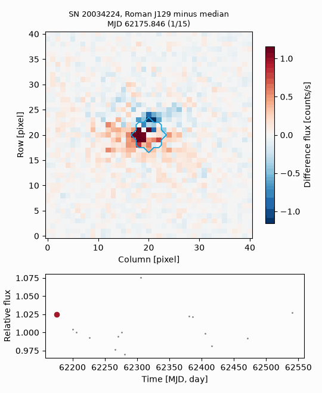
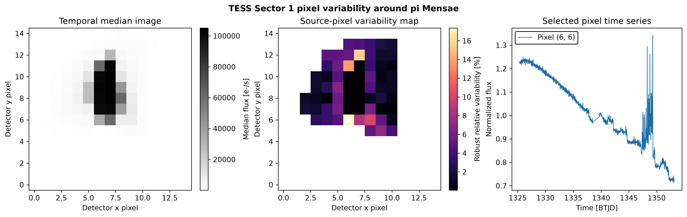

# Lygos

## Purpose
Lygos retrieves, processes, visualizes, and animates images from the Transiting Exoplanet Survey Satellite (TESS) and the Nancy Grace Roman Space Telescope, and extracts TESS light curves with image-based photometry. Documentation is at https://lygos.readthedocs.io and its source in `docs/`.

## Images from TESS and Roman
Every retrieval returns one `ImageStack`, a time-ordered cube of images with times, uncertainties, quality flags, and sky coordinates. Background subtraction, difference imaging, variability maps, apertures, aperture photometry, centroids, plots, and animations therefore work the same way for every product.

| Product | Source | Function |
| --- | --- | --- |
| TESS cutouts | MAST TESSCut | `get_tess_cutout` |
| TESS full-frame images | public MAST bucket on Amazon Web Services | `get_tess_ffi`, `get_tess_ffi_cutout` |
| Roman detector images | OpenUniverse 2024 simulation at IRSA | `read_roman_image` |
| Roman cutout time series | OpenUniverse 2024 simulation at IRSA | `get_roman_cutout` |

No archive account is needed, and only the pixels a cutout needs are transferred.

```python
import lygos

stack = lygos.get_tess_cutout("RR Lyr", sector=14, size=15)[0].good()
aperture = stack.threshold_aperture(threshold=5.0)
lygos.animate_stack(stack.select(slice(0, 120)), "rrlyr", aperture=aperture,
                    light_curve=stack.select(slice(0, 120)).aperture_photometry(aperture))

roman = lygos.get_roman_cutout((9.6632, -43.88128), band="J129", size=41, mjd_range=(62150, 62550))
lygos.animate_stack(roman.subtract_background(), "supernova", difference=True)
```



Examples in `examples/tess_cutout_time_series/`, `examples/tess_full_frame_images/`, and `examples/roman_time_domain_supernova/` use only public data.

## Pixel-level variability

`ImageStack.variability_map()` measures scatter relative to the pixel uncertainties when available. `ImageStack.relative_variability_map()` instead reports robust scatter as a percentage of each pixel's median flux. The public Sector 1 example plots the median image, relative variability, and the most variable source pixel's light curve.

```bash
python examples/tess_pixel_variability/tess_pixel_variability.py
```



## Image-based photometry
Lygos inspects target-pixel images, models or extracts stellar fluxes from image stacks, assesses contamination from nearby sources, and produces light curves with image-level diagnostics.

## Installation

```bash
cd /path/to/lygos
pip install -e .
export LYGOS_PATH=/path/to/lygos
```

`LYGOS_PATH` identifies the repository root, whose `data/` and `visuals/` directories are ignored by Git. The workflow separately expects a configured working-data directory, typically via `LYGOS_DATA_PATH` or an explicit project path; that existing variable retains its dataset and output semantics.

## Minimal usage

```python
import lygos

# Example workflow entry point
# lygos.main.init(strgmast='WASP-121')
# or
# lygos.main.init(toiitarg=1233)
```

The package is designed to run through the importable workflow entry points rather than through ad hoc local scripts.

## Public TESS target-pixel example

With `LYGOS_PATH` set to the repository root, run:

```bash
python examples/public_tess_target_pixel.py --typefileplot png
```


The example queries the public Mikulski Archive for Space Telescopes (MAST) for the WASP-121 SPOC target-pixel products, selects TESS Sector 7, masks nonzero quality flags, and calculates the median 11 by 11 pixel count map with nearby TESS Input Catalog sources overlaid. The figure contains observed TESS data rather than a simulation and quantifies the image-level contamination context. This example does not extract a light curve.

## Input, intermediate products, and outputs
A good Lygos run should produce a visible chain of products:

- input image or target metadata;
- extracted or modeled source apertures;
- intermediate photometric diagnostics;
- final target light curves and summary plots.

Lygos writes these products under the configured data and visualization directories.
