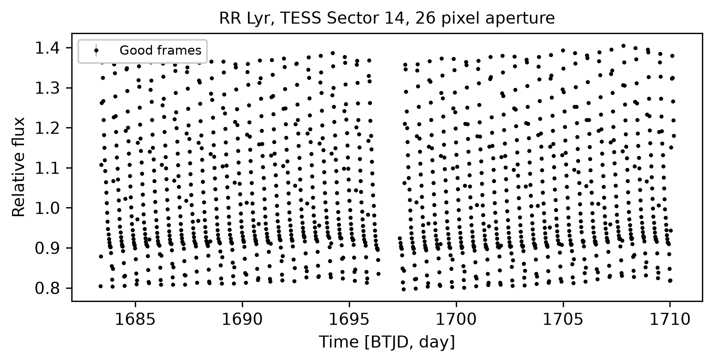
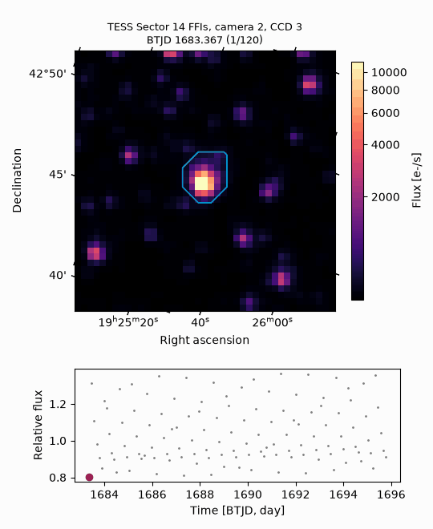
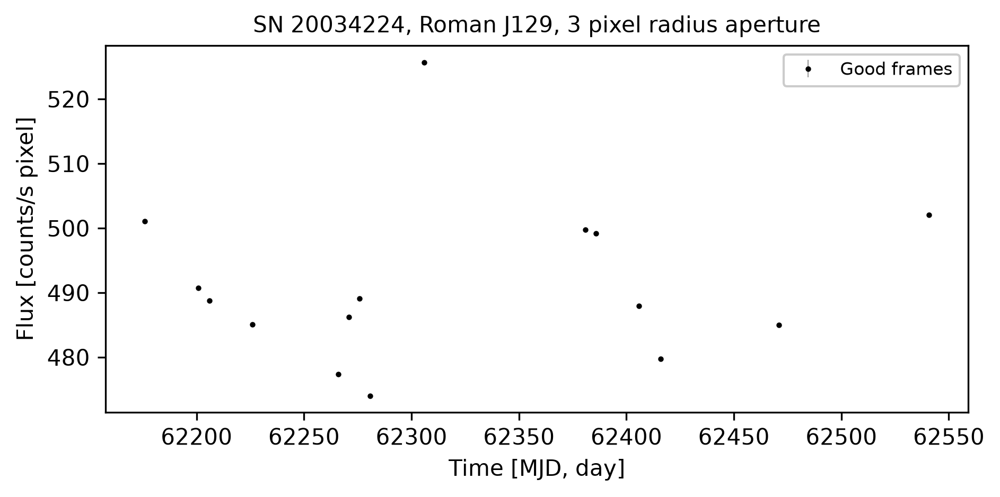

Examples
========

Each example lives in ``examples/<name>/``, uses only public data, and writes its figures to
``examples/<name>/visuals/``. Run them from the repository root after setting
``LYGOS_PATH``.

``tess_cutout_time_series``
---------------------------

Real TESS Sector 14 TESSCut images of the RR Lyrae star RR Lyr, which pulsates with a
0.567 day period. The example draws a threshold aperture, measures a light curve with a
peak-to-peak variation of about 50% of the median flux, and animates 2.5 days of images
with the light curve. The run takes about 25 seconds.

.. code-block:: bash

   python examples/tess_cutout_time_series/tess_cutout_time_series.py

``tess_full_frame_images``
--------------------------

Real TESS Sector 14 full-frame images of camera 2, CCD 3, read from the public bucket.
The example plots one complete 2048 by 2048 pixel frame, cuts a 41 by 41 pixel region
around RR Lyr from every fifth frame of the sector, maps per-pixel variability, and
animates the region with RR Lyr's light curve. The run takes about 3 minutes.

.. code-block:: bash

   python examples/tess_full_frame_images/tess_full_frame_images.py

``roman_time_domain_supernova``
-------------------------------

Simulated Roman J129 images of SN 20034224 from the OpenUniverse 2024 time-domain survey,
a Type Ia supernova at redshift 0.26 on a compact host galaxy. The example finds every
exposure within 200 days of the simulated peak, reads the full detector image closest to
the peak, streams aligned 41 by 41 pixel cutouts, and animates the difference images. The
supernova appears near MJD 62306 and adds about 40 counts/s within 3 pixels of its
position. The run takes about 1 minute.

.. code-block:: bash

   python examples/roman_time_domain_supernova/roman_time_domain_supernova.py

``public_tess_target_pixel``
----------------------------

Runs the photometry pipeline :func:`lygos.init` on the public WASP-121 target pixel file
of TESS Sector 7 and plots the median image with nearby TESS Input Catalog sources.

.. code-block:: bash

   python examples/public_tess_target_pixel.py
