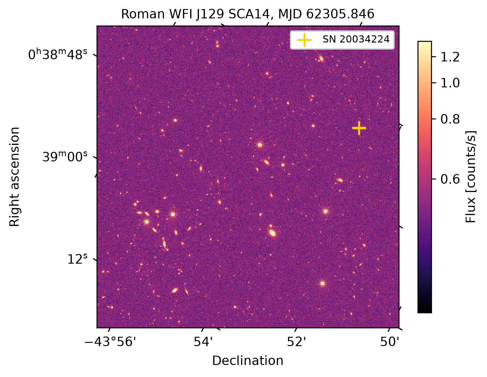

Roman images
============

The Roman Wide Field Instrument (WFI) has 18 detectors of 4088 by 4088 pixels at
0.11 arcsec per pixel. Roman has not yet launched, so lygos reads the public
OpenUniverse 2024 simulation of Roman imaging, hosted by the NASA/IPAC Infrared Science
Archive (IRSA) at ``s3://nasa-irsa-simulations/openuniverse2024/roman``.

Two simulated surveys are available, each in a ``"preview"`` release and a ``"full"``
release.

``"TDS"``
   The time-domain survey revisits the same fields about every 5 days in seven filters,
   with transients such as Type Ia supernovae. The preview covers about 240 epochs per
   filter of each field, which suits time series and animations.
``"WAS"``
   The wide-area survey maps a larger area with fewer visits.

``kind="simple_model"`` selects calibrated images with noise, and ``kind="truth"`` the
noiseless scenes.

Finding exposures
-----------------

:func:`~lygos.roman.load_roman_pointings` reads the simulated observing sequence, with
the sky position of all 18 detectors in every pointing.
:func:`~lygos.roman.list_roman_images` lists which images exist in the archive and caches
the list. :func:`~lygos.roman.find_roman_images` combines the two and returns every
exposure that covers a target, in time order.

.. code-block:: python

   records = lygos.find_roman_images((9.6632, -43.88128), bands=("J129",), mjd_range=(62150, 62550))
   records[0]
   # {'band': 'J129', 'pointing': 572, 'detector': 9, 'mjd': 62005.8, 'exptime': 302.3, ...}

The first search of a filter lists the archive once, which takes several seconds. Later
searches read the cached list.

Full detector images
--------------------

:func:`~lygos.roman.read_roman_image` downloads one compressed detector image, about
20 to 55 MB, and returns its science image, uncertainty image, and pixel flags
(``metadata["pixel_quality"]``) as count rates [counts/s].

Cutout time series
------------------

:func:`~lygos.roman.get_roman_cutout` returns one frame per exposure that covers the
target. The files are compressed with gzip, which does not allow reading pixel sections
directly. lygos therefore decompresses each file as a stream and stops after the last
detector row it needs. A cutout 300 rows from the bottom of a detector transfers about
2 MB of a 30 MB file.

Consecutive exposures come from different pointings, detectors, and roll angles. With
``align=True``, the default, every cutout is resampled onto one north-up grid at the
native pixel scale, so frames can be differenced, stacked, and animated. With
``align=False`` cutouts stay on their detector grids, and the WCS of each frame is kept
in ``metadata["frame_wcs"]``.

.. code-block:: python

   stack = lygos.get_roman_cutout("00h38m39.2s -43d52m52.6s", band="J129", size=41,
                                  mjd_range=(62150, 62550))

Limitations
-----------

Resampling uses cubic-spline interpolation through each frame's WCS. It aligns sources
to a small fraction of a pixel, but it does not match point-spread functions (PSFs)
across detectors, so bright compact sources leave small residuals in difference images.
The image values follow the OpenUniverse 2024 conventions and will change when real
Roman data products become available.
