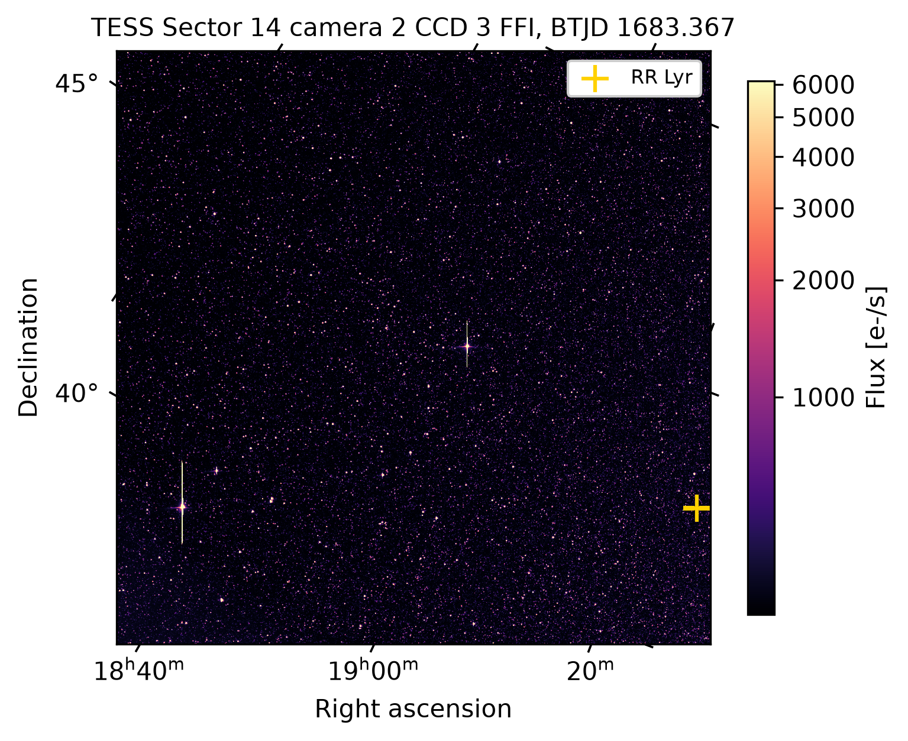

TESS images
===========

TESS observes each 24 by 96 degree sector for about 27 days with four cameras of four
charge-coupled devices (CCDs) each, at 21 arcsec per pixel. lygos reads two calibrated
products.

Which sectors observed a target
-------------------------------

:func:`~lygos.tess.tess_sectors` asks TESSCut which sectors, cameras, and CCDs covered a
target. For a sector without a TESSCut entry, :func:`tdpy.tess.locate_tess_target`
predicts the camera, CCD, and pixel from the sector pointing.

.. code-block:: python

   lygos.tess_sectors("RR Lyr")
   # [{'sector': 14, 'camera': 2, 'ccd': 3}, {'sector': 15, ...}, ...]

Cutouts from TESSCut
--------------------

:func:`~lygos.tess.get_tess_cutout` downloads target pixel files cut from the full-frame
images by the Mikulski Archive for Space Telescopes (MAST) TESSCut service and returns
one stack per sector. Pixels are calibrated and background subtracted, and the cadence is
30, 10, or 3.3 minutes depending on the mission year. Files are cached, so a second call
reads them from disk. :func:`~lygos.tess.read_tess_cutout` reads a file downloaded
elsewhere.

.. code-block:: python

   stacks = lygos.get_tess_cutout("RR Lyr", size=15)           # every sector
   stack = lygos.get_tess_cutout("RR Lyr", sector=14, size=15)[0]
   stack.metadata["background"]                                # the TESSCut background [e-/s]

Full-frame images
-----------------

Calibrated full-frame images (FFIs) of every sector are public on Amazon Web Services at
``s3://stpubdata/tess/public/ffi``. They are uncompressed, so lygos reads pixel sections
over the network without downloading whole files.

:func:`~lygos.tess.list_tess_ffis` lists the FFIs of one sector, camera, and CCD in time
order. :func:`~lygos.tess.get_tess_ffi` reads one complete frame with its uncertainty
image. By default the overscan columns are trimmed to the 2048 by 2048 pixel science
area and the world coordinate system (WCS) is shifted to match.

.. code-block:: python

   frame = lygos.get_tess_ffi(sector=14, camera=2, ccd=3, index=0)
   lygos.plot_image(frame, "full_frame", frame=0)

:func:`~lygos.tess.get_tess_ffi_cutout` cuts a region of any size from every FFI of a
sector, so it works for regions larger than TESSCut serves and does not depend on the
TESSCut service. ``stride`` keeps every n-th frame and ``max_frames`` caps the transfer.

.. code-block:: python

   region = lygos.get_tess_ffi_cutout("RR Lyr", sector=14, size=41, stride=5, max_frames=120)

Quality flags
-------------

Each frame carries the TESS quality bitmask, ``QUALITY`` for TESSCut and ``DQUALITY``
for FFIs. :meth:`~lygos.imagestack.ImageStack.good` keeps frames with zero flags and
finite pixels. Light-curve plots mark flagged frames separately.
