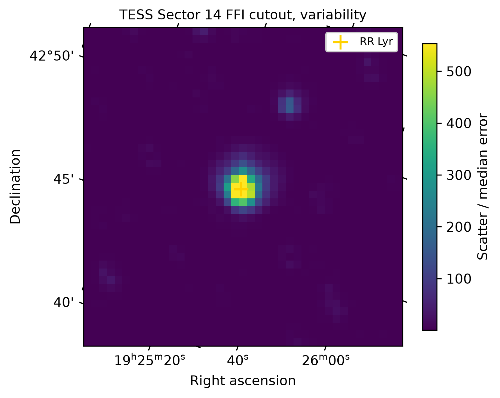
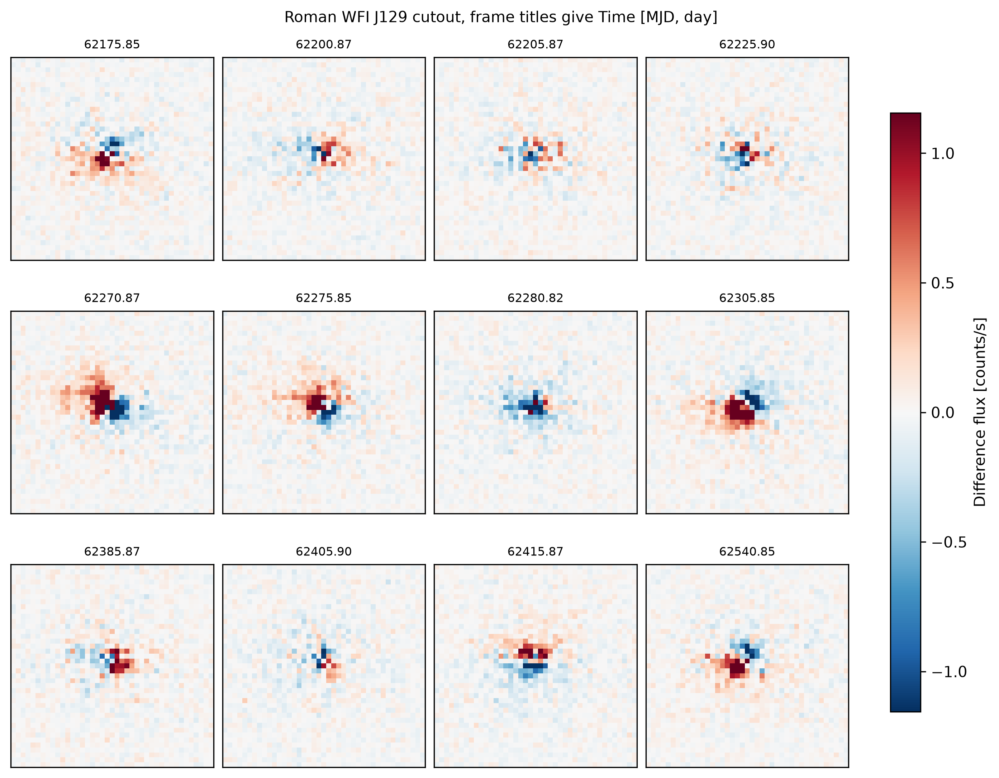
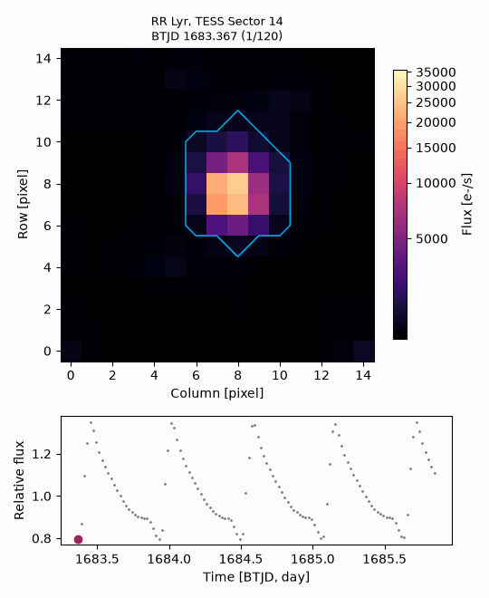

Visualization and animation
===========================

Every plotting function accepts an :class:`~lygos.imagestack.ImageStack` from any mission,
writes PNG files at 300 dots per inch or PDF files (``typefileplot="png"`` or ``"pdf"``),
and returns the file path. Intensities use an arcsinh, logarithmic, square-root, or
linear ``stretch`` between robust percentiles. All frames of a mosaic or animation share
one intensity scale, so brightness changes between frames are real.

Single images
-------------

:func:`~lygos.visualization.plot_image` shows one frame (an index), the ``"median"`` image,
or the ``"variability"`` map. With ``sky=True``, the default, the axes show right
ascension and declination. ``aperture`` outlines a Boolean mask, and ``markers`` labels
positions.

.. code-block:: python

   lygos.plot_image(stack, "median", aperture=aperture, markers={"RR Lyr": stack.pixel_of(target)})
   lygos.plot_image(stack.subtract_background(), "variability", frame="variability", stretch="linear")

Mosaics and light curves
------------------------

:func:`~lygos.visualization.plot_mosaic` shows evenly spaced frames in a grid. With
``difference=True`` each frame has the median image removed, on a symmetric scale.
:func:`~lygos.visualization.plot_light_curve` plots an aperture light curve and marks
frames with nonzero quality flags.

Animations
----------

:func:`~lygos.visualization.animate_stack` writes an animated GIF with one frame per image.
With ``light_curve`` a lower panel shows the light curve with the current frame marked,
and with ``difference=True`` only changing sources remain. ``max_frames`` renders evenly
spaced frames and ``duration_ms`` sets the time per frame [ms]. Animations use one color
palette for all frames, written by :func:`tdpy.plotting.write_animation`.

.. code-block:: python

   lygos.animate_stack(stack, "animation", aperture=aperture, light_curve=light_curve, max_frames=120)

